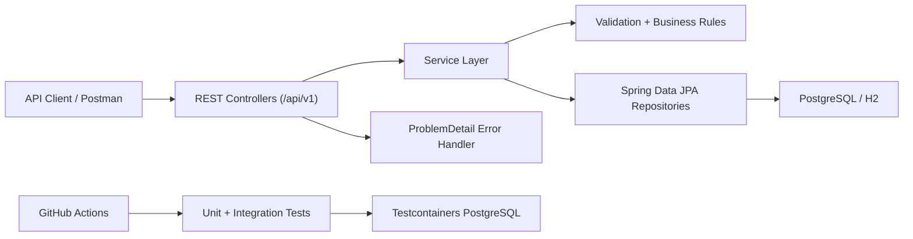
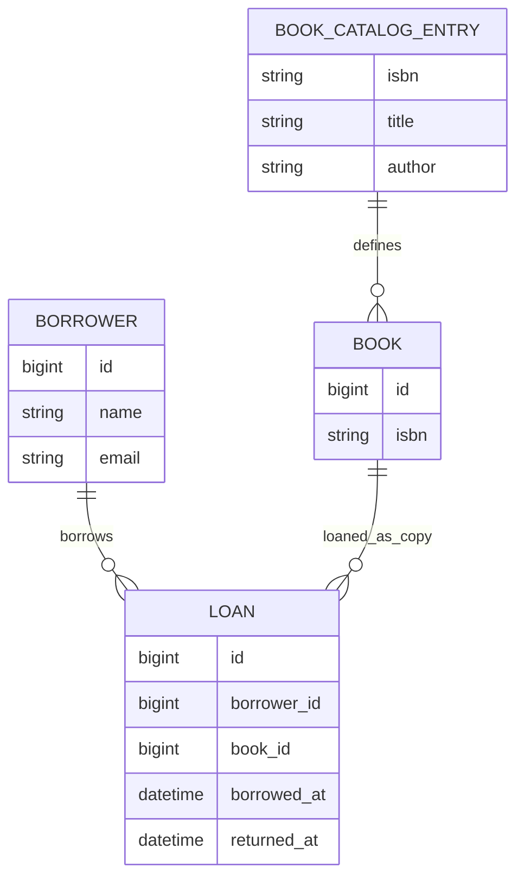

# Library System API

Production-style REST API for managing borrowers, books, and borrowing operations in a simple library system.

## Stack
- Java 17
- Spring Boot 3.5
- Spring Web, Validation, Data JPA
- Flyway for schema migrations
- H2 for local development
- PostgreSQL for production-style deployment and integration testing

## Why PostgreSQL
PostgreSQL is the primary database target because it gives stronger production characteristics than an embedded database: better transactional guarantees, predictable locking behavior for borrow/return workflows, and a clear upgrade path for real deployments. H2 is still included for local development and test speed.

## Features
- API versioning through `/api/v1`
- Borrower registration with unique email enforcement
- Book registration with schema-backed ISBN consistency validation
- Multiple copies supported through unique book ids
- Pagination and sorting for book listing
- Borrow and return workflows with active-loan enforcement
- Centralized `ProblemDetail` error responses
- Swagger UI and OpenAPI output
- Docker packaging and GitHub Actions CI

## 12-Factor Alignment
- Configuration is externalized through Spring profiles and environment variables such as `DB_URL`, `DB_USERNAME`, and `DB_PASSWORD`.
- Backing services are treated as attached resources, with PostgreSQL swapped by environment rather than code changes.
- The application is packaged as a single deployable container image and built the same way in local and CI environments.
- Logs are written to standard output by default, which fits container and platform runtime expectations.
- The stateless API design keeps runtime instances disposable, with persistence handled by the database layer.

## Architecture

### Application flow


### Domain model


## Running locally
1. Start the application with the default local profile:

```bash
./gradlew bootRun
```

2. Open the API docs:
- Swagger UI: [http://localhost:8080/swagger-ui.html](http://localhost:8080/swagger-ui.html)
- OpenAPI JSON: [http://localhost:8080/v3/api-docs](http://localhost:8080/v3/api-docs)
- H2 console: [http://localhost:8080/h2-console](http://localhost:8080/h2-console)

## Running with PostgreSQL
Use Docker Compose to launch PostgreSQL and the API with the `prod` profile:

```bash
docker compose up --build
```

The API will be available at [http://localhost:8080](http://localhost:8080).

## Profiles
- `local`: in-memory H2, enabled by default
- `test`: PostgreSQL-backed integration testing via Testcontainers
- `prod`: PostgreSQL driven by `DB_URL`, `DB_USERNAME`, and `DB_PASSWORD`

## API summary
- `POST /api/v1/borrowers`
- `POST /api/v1/books`
- `GET /api/v1/books?page=0&size=20&sort=title,asc`
- `POST /api/v1/borrowers/{borrowerId}/borrowed-books/{bookId}`
- `DELETE /api/v1/borrowers/{borrowerId}/borrowed-books/{bookId}`

## Sample requests

### Register borrower
```json
{
  "name": "Alice Johnson",
  "email": "alice@example.com"
}
```

### Register book
```json
{
  "isbn": "9780132350884",
  "title": "Clean Code",
  "author": "Robert C. Martin"
}
```

### Borrow book
```http
POST /api/v1/borrowers/1/borrowed-books/2
```

### Return book
```http
DELETE /api/v1/borrowers/1/borrowed-books/2
```

### List books
```http
GET /api/v1/books?page=0&size=2&sort=title,asc
```

## Sample responses

### Borrower response
```json
{
  "id": 1,
  "name": "Alice Johnson",
  "email": "alice@example.com",
  "createdAt": "2026-03-22T08:00:00Z"
}
```

### Borrow response
```json
{
  "loanId": 10,
  "borrowerId": 1,
  "bookId": 2,
  "timestamp": "2026-03-22T08:05:00Z",
  "status": "ACTIVE"
}
```

### Paginated books response
```json
{
  "content": [
    {
      "id": 2,
      "isbn": "9780132350884",
      "title": "Clean Code",
      "author": "Robert C. Martin",
      "available": true,
      "createdAt": "2026-03-22T08:02:00Z"
    }
  ],
  "page": 0,
  "size": 20,
  "totalElements": 1,
  "totalPages": 1,
  "first": true,
  "last": true,
  "sort": [
    "title,asc"
  ]
}
```

## Pagination defaults
- Default page: `0`
- Default size: `20`
- Maximum size: `100`
- Default sort: `title,asc`
- Allowed sort fields: `id`, `isbn`, `title`, `author`, `createdAt`

## Testing
Run the full verification suite with:

```bash
./gradlew clean test
```

The test suite includes service-level unit tests, controller tests with MockMvc, and PostgreSQL-backed integration tests via Testcontainers for borrow/return locking and schema invariants.

CI also builds the Docker image and performs a container startup smoke test against `/actuator/health`.

## Postman
The Postman collection is checked in at [postman/Library System API.postman_collection.json](postman/Library%20System%20API.postman_collection.json).

## Assumptions
- A borrower may borrow multiple different book copies at the same time.
- Only one active borrower may hold a specific `bookId` at a time.
- Returning a book requires an active loan for the same borrower and book copy.
- Authentication, authorization, due dates, reservations, fines, and borrowing limits are out of scope.
